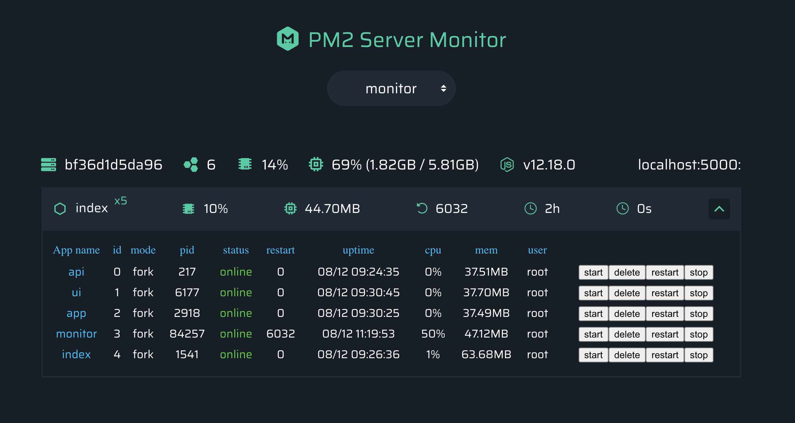

<h1 align="center">
    pm2 server monitor UI
	<br>
</h1>

<div align="center">

Before start, you need to have the following tools installed on computer: [Git](https://git-scm.com), [Node.js](https://nodejs.org/en/) and/or [Yarn](https://yarnpkg.com/). [MySQl::Workbench](https://www.mysql.com/products/workbench/).

[How To Install MySQL on Ubuntu 20.04](https://www.digitalocean.com/community/tutorials/how-to-install-mysql-on-ubuntu-20-04)

<br>
	  <a href="https://choosealicense.com/licenses/mit">
		
	</a>
	
	<a href="https://github.com/amariwan/reactJs-Mysql-Auth">
		
	</a>
</div>


This is modified as single server instance to run inside docker container, this runs on port specified

## Preview


## Usage

Install the monitor module with npm, in your project:

```bash
> npm i --save pm2-server-monitor
```

Use the module in top of your project code:

```js
const monitor = require('pm2-server-monitor');
monitor({
    // your server name, as a flag
    name: 'local',

    // your server listening port
    port: 3001
});
```
*Your can view the `./example` folder for reference.*

Start your server with PM2, don't forget the `--no-treekill` argument:

```bash
> pm2 start bin/www -i max --no-treekill
```

Add the servers info in `./UI/config.js` file:

```js
const servers = {
    'local': [{
        ip: '127.0.0.1',
        port: 3001,
        show: false
    }]
}
```

Open `./UI/index.html` to see the monitor UI.

**Note:** you can put the `./UI` folder anywhere, it has zero dependencies.

Enjoy it :)

## License
License (MIT)
